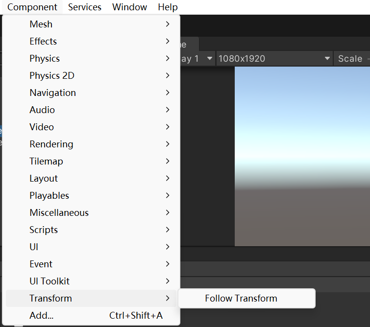
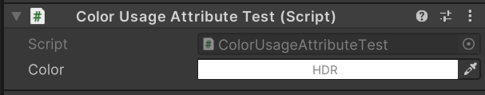
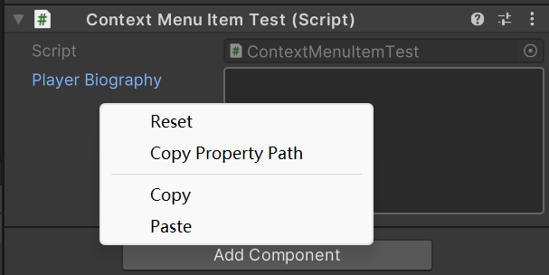

# Unity-Built-In-Attributes

# UnityEngine Attributes

- AddComponentMenu

```c#
using UnityEngine;

[AddComponentMenu("Transform/Follow Transform")]
public class AddComponentMenuTest : MonoBehaviour
{
}
```



- AssemblyIsEditorAssembly
- BeforeRenderOrder
- ColorUsage

```c#
using UnityEngine;

public class ColorUsageAttributeTest : MonoBehaviour
{
    [ColorUsage(false,true)]
    public Color color = Color.white;
}
```



- ContextMenu
- ContextMenuItem

```c#
using UnityEngine;

public class ContextMenuItemTest : MonoBehaviour
{
    [ContextMenuItem("Reset", "ResetBiography")]
    [Multiline(8)]
    [SerializeField] 
    string playerBiography = "";

    void ResetBiography()
    {
        playerBiography = "";
    }
}
```



- CreateAssetMenu
- CustomGridBrush
- DefaultExecutionOrder
- Delayed
- DisallowMultipleComponent
- ExcludeFromObjectFactory
- ExcludeFromPreset
- ExecuteAlways
- ExecuteInEditMode
- GradientUsage
- GUITarget
- Header
- HelpURL
- HideInCallstack
- HideInInspector
- Icon
- InspectorName
- InspectorOrder
- Min
- Multiline
- NonReorderable
- PreferBinarySerialization
- Property
- Range
- RequireComponent
- RuntimeInitializeOnLoadMethod
- SelectionBase
- SerializeField
- SerializeReference
- SharedBetweenAnimators
- Space
- TextArea
- Tooltip
- UnityAPICompatibilityVersion

